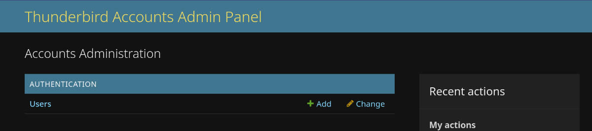
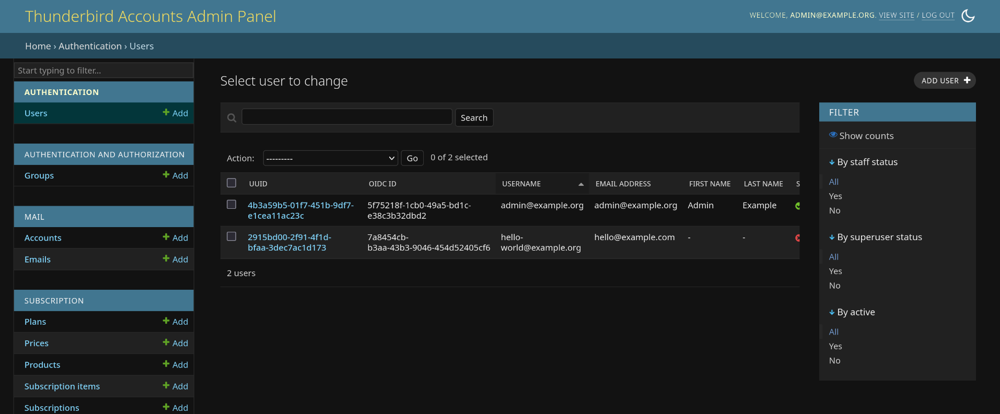
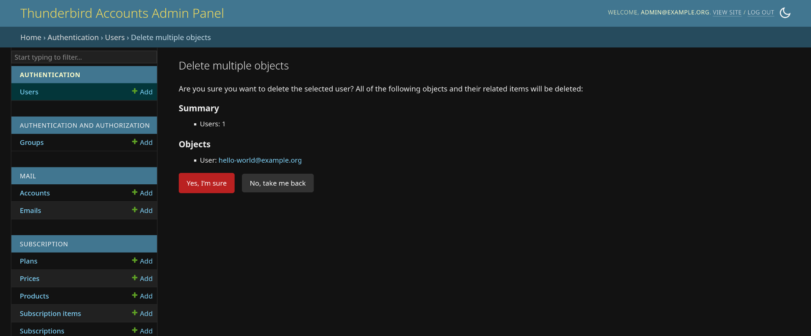
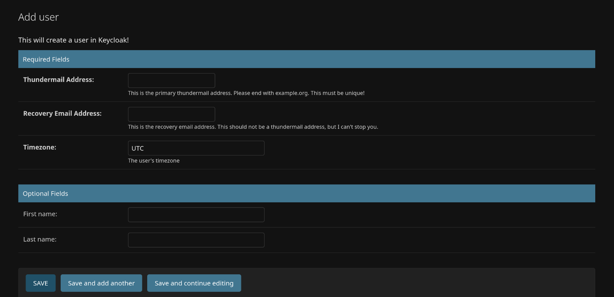
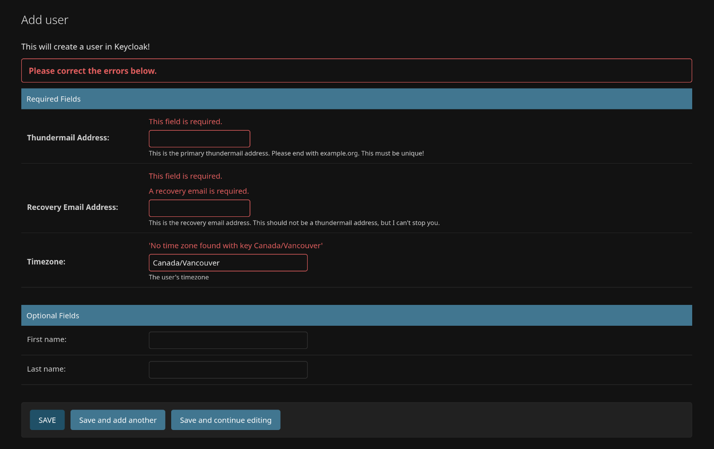
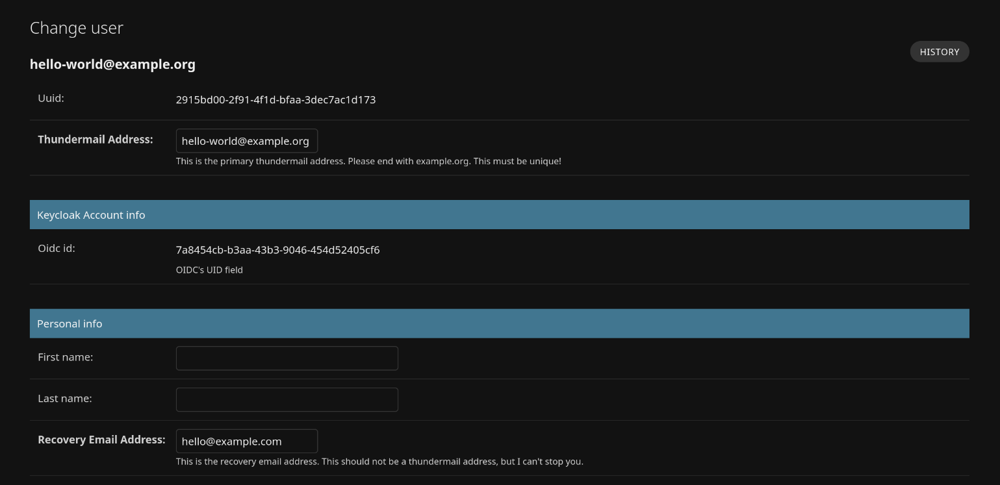
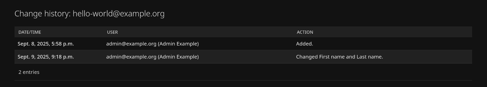

# Users

Users can be easily managed within Account's [admin panel](https://accounts.tb.pro/admin). Depending on your permissions
you may or may not have access to a variety of options.

## User list

Selecting the User model from the admin panel's main page will display a list of all users in the middle of the page
as well as a search bar. To the left of the page you'll see the standard list of Apps and their Models, and to the
right of the page you'll see the `Add User +` button at the top, and some basic filter options below that.

From this page you can click on a user's UUID field (shown in highlighted in blue) to view their profile information in
more depth. You can also select one or many user's to perform actions on.

There are currently two available actions:

* Delete selected user(s).
* Fix Broken Stalwart Account.

### Deleting Users

Deleting a user will **remove their ability to login and access** Thunderbird Pro Services, as well as
**delete their data** from Stalwart (our mail server), Keycloak (our authentication server).

Their subscription will still remain, and will have to be cancelled manually if not already done so. We plan on
hooking up an automatic cancellation request to Paddle in the near future.

Upon selecting this action you'll be shown a confirmation screen.

### Fix Broken Stalwart Account

This action will run through the following edge-cases that may arise.

The steps are as follows:

* Does the user have a Stalwart account (mailbox)
* Does that account have a thundermail address attached to it

If the user does not have a Stalwart account then one is created on the spot and their email is automatically attached.
If the user does have a Stalwart account but does not have their email attached, then their email will be attached.

If the fix creates or fixes something succesfully you'll see a message similar to:
"Create/Fixed x Stalwart email addresses/accounts."

If there's an error you'll see "Failed to fix x Stalwart accounts.". Please follow up with an engineer on steps to
remedy this.

Finally, if there is nothing to fix then you'll see a "Nothing to fix!" message.

## Adding Users

When you land on the Add user page you'll see that it only requires 3 fields:

* Thundermail Address: username@thundermail.com or username@stage-thundermail.com depending on environment.
* Recovery Email Address: The email that will receive the `Update password` and other service emails.
* Timezone: In tz data format. An exhaustive list is
  available [here](https://en.wikipedia.org/wiki/List_of_tz_database_time_zones#List).

Additionally, the first and last names are optional and are part of the default database schema, and keycloak's
user profile. These fields are intended for display purposes only, and won't be used for billing. For display purposes
they will be concatenated together with a space between.

It'd be good to refresh up
on [common falsehoods about names](https://www.kalzumeus.com/2010/06/17/falsehoods-programmers-believe-about-names/)
too.

There are three action buttons on this form. The standard `SAVE` button will bring you back to the user list. While
`Save and add another` will bring you back to this screen, and finally `Save and continue editing` will bring you to the
change user screen.

If the data you entered contains invalid data (e.g. blank required field, or an incorrect timezone) you will be shown an
error.

If there are no issues with the data, you'll be brought to one of the three places you've selected and that user will be
created on Keycloak and promptly sent an `Update your password` type email.

## Changing Users

When you land on the Change user page you'll see their Thundermail address at the top left, along with their data laid
out in a similar manner to the Add user page. Here you can edit some of the fields and those changes will propagate to
Keycloak. Some of these fields include the previous required fields, as well as some new ones like user permissions.

Unless you're a super admin you probably won't have access to many permission related actions, but here is where you
can assign users to permission groups so they can perform various actions on the admin panel.

Like the Add user page any invalid data will return you back to the form with error messages, and any successful changes
will propagate to Keycloak.

It's not recommended to change the Thundermail address at this time.

## History

On some pages you'll see a button called History. Here you can see an audit log of who performed an action, what that
action was (high level), and when that action was performed. An even higher-level version of this page for all changes 
is located on the main admin panel titled as `Recent Actions`. 

