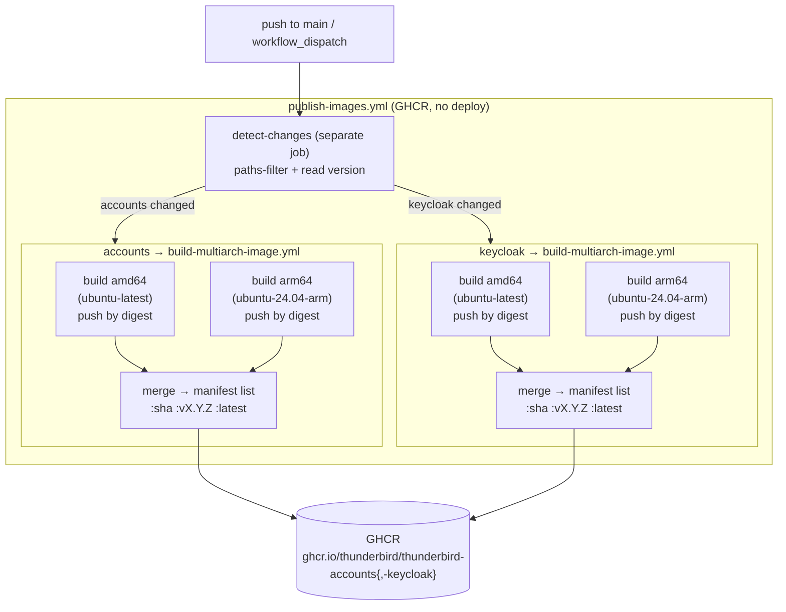
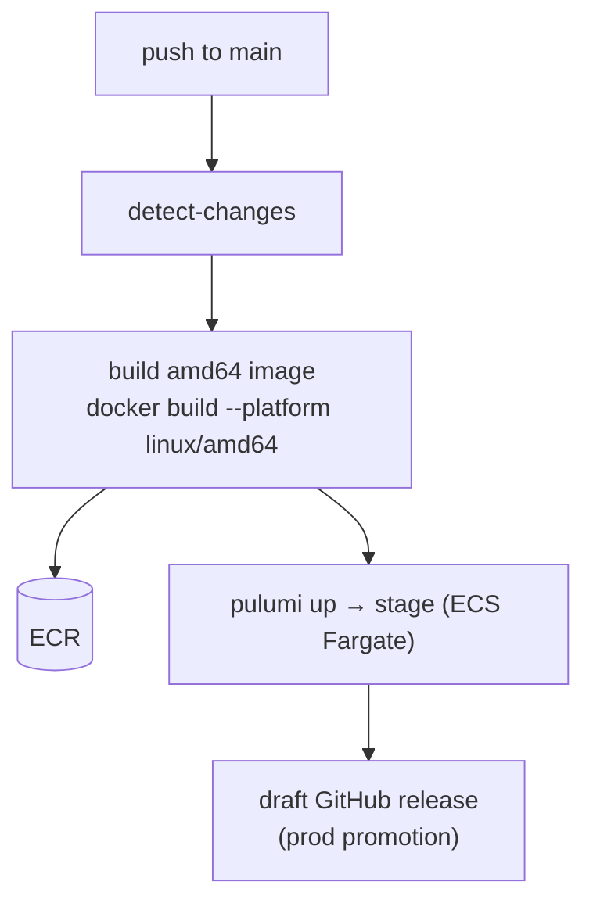

# CI image pipelines

Two **independent** pipelines produce container images. They share no jobs, no
credentials, and no triggers beyond both reacting to `main`.

| Pipeline | Workflow | Registry | Arch | Purpose |
|---|---|---|---|---|
| **Deploy-stage** | `merge.yml` | ECR | amd64 only | Build + deploy to stage (ECS Fargate) via Pulumi |
| **Publish-images** | `publish-images.yml` + `build-multiarch-image.yml` | GHCR | amd64 + arm64 | Publish multi-arch manifest lists; no deploy |

## Publish-images (new, decoupled)

Native-runner split-arch build: each architecture builds on its own hardware
(no QEMU emulation) and pushes to GHCR by digest; a merge step stitches the
digests into one manifest list tagged `:<sha>`, `:v<version>`, and `:latest`.
Auth is the automatic `GITHUB_TOKEN` (`packages: write`) — no cloud credentials.

## Deploy-stage (unchanged, for contrast)

`merge.yml` still owns deployment: it builds the amd64 image, pushes to ECR,
and runs a single `pulumi up` to stage. It assumes the AWS deploy role via OIDC.

## Why they're separate

- **Blast radius** — the GHCR publish holds no cloud credentials, so a branch or
  fork build can never assume the deploy role (the trust-boundary concern that
  killed running the deploy workflow off feature branches).
- **Independent cadence** — image publishing and stage deployment can evolve,
  fail, and be re-run without affecting each other.
- **Native multi-arch** — arm64 builds on real Graviton runners instead of QEMU
  emulation, so they're faster and not subject to emulation miscompiles.
