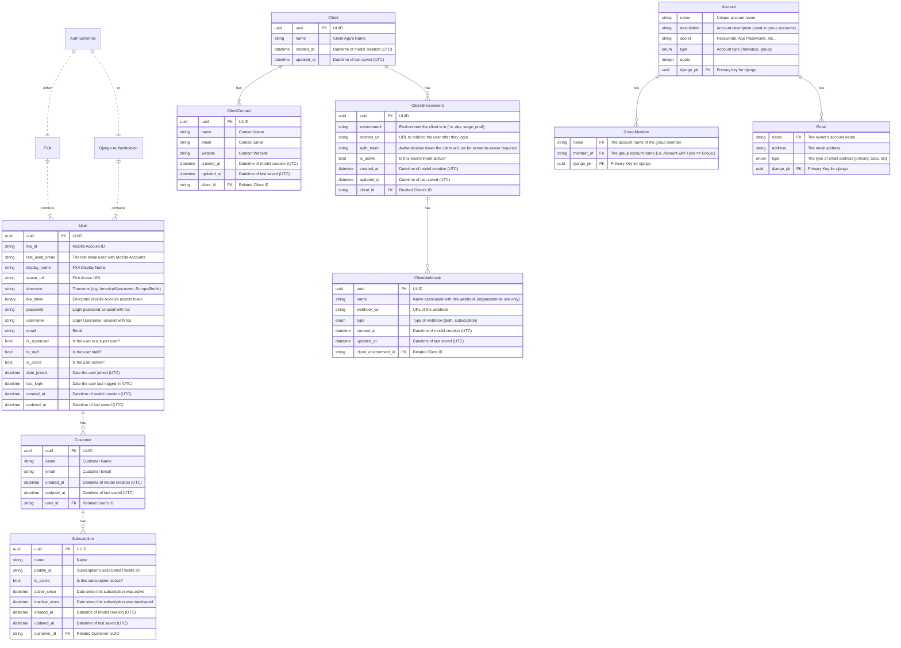

## Database Entity Relational Diagram

The following is up to date as of: Nov 14th, 2024

```mermaid
erDiagram  

    %%{External APIs}%%
    FXA
	FXA ||..|{ User : connects

    "Django Authentication"
	"Django Authentication" ||..|{ User : connects

    "Auth Schemes"
    "Auth Schemes" ||..|| FXA : either
    "Auth Schemes" ||..|| "Django Authentication" : or


	%%{Authentication App}%%
	User {
		uuid uuid PK "UUID"
		string fxa_id "Mozilla Account ID"
		string last_used_email "The last email used with Mozilla Accounts"
		string display_name "FXA Display Name"
		string avatar_url "FXA Avatar URL"
		string timezone "Timezone (e.g. America/Vancouver, Europe/Berlin)"
        binary fxa_token "Encrypted Mozilla Account access token"

		%%{Django defaults}%%
		string password "Login password, unused with fxa"
		string username "Login Username, unused with fxa"
		string email "Email"

        bool is_superuser "Is the user is a super user?"
		bool is_staff "Is the user staff?"
		bool is_active "Is the user active?"
		datetime date_joined "Date the user joined (UTC)"
		datetime last_login "Date the user last logged in (UTC)"

		datetime created_at "Datetime of model creation (UTC)"
		datetime updated_at "Datetime of last saved (UTC)"
	}
	
	%%{Client App}%%
	Client {
		uuid uuid PK "UUID"
		string name "Client App's Name"

		datetime created_at "Datetime of model creation (UTC)"
		datetime updated_at "Datetime of last saved (UTC)"
	}

	ClientContact {
		uuid uuid PK "UUID"
		string name "Contact Name"
		string email "Contact Email"
		string website "Contact Website"
		
		datetime created_at "Datetime of model creation (UTC)"
		datetime updated_at "Datetime of last saved (UTC)"

        string client_id FK "Related Client ID"
	}
	Client ||--|{ ClientContact : has

    ClientEnvironment {
        uuid uuid PK "UUID"
        string environment "Environment the client is in (i.e. dev, stage, prod)"
		string redirect_url "URL to redirect the user after they login"
		string auth_token "Authentication token the client will use for server-to-server requests" 
        bool is_active "Is this environment active?"

		datetime created_at "Datetime of model creation (UTC)"
		datetime updated_at "Datetime of last saved (UTC)"

        string client_id FK "Realted Client's ID"
    }

	ClientWebhook {
		uuid uuid PK "UUID"
		string name "Name associated with this webhook (organizational use only)"
		string webhook_url "URL of the webhook"
		enum type "Type of webhook [auth, subscription]"
		
		datetime created_at "Datetime of model creation (UTC)"
		datetime updated_at "Datetime of last saved (UTC)"

        string client_environment_id FK "Related Client ID"
	}
	ClientEnvironment ||--o{ ClientWebhook : has

    Client ||--o{ ClientEnvironment : has

	%%{Subscription App}%%
	Customer {
		uuid uuid PK "UUID"
		string name "Customer Name"
		string email "Customer Email"

		datetime created_at "Datetime of model creation (UTC)"
		datetime updated_at "Datetime of last saved (UTC)"

        string user_id FK "Related User's ID"
	}
    User ||--o{ Customer : has

	Subscription {
		uuid uuid PK "UUID"
		string name "Name"
		string paddle_id "Subscription's associated Paddle ID"
		bool is_active "Is this subscription active?"
		datetime active_since "Date since this subscription was active"
		datetime inactive_since "Date since this subscription was inactivated"

		datetime created_at "Datetime of model creation (UTC)"
		datetime updated_at "Datetime of last saved (UTC)"

		string customer_id FK "Related Customer UUID"
	}
	Customer ||--o{ Subscription : has

    %%{Mail App}%%
    Account {
        string name "Unique account name"
        string description "Account description (used in group accounts)"
        string secret "Passwords, App Passwords, etc..."
        enum type "Account type [individual, group]"
        integer quota 
        uuid django_pk PK "Primary key for django" 
    }

    GroupMember {
        string name FK "The account name of the group member"
        string member_of FK "The group account name (i.e. Account with Type == Group.)"
        uuid django_pk PK "Primary Key for django"
    }
    Account ||--o{ GroupMember : has

    Email {
        string name FK "The owner's account name"
        string address "The email address"
        enum type "The type of email address [primary, alias, list]"
        uuid django_pk PK "Primary Key for django"
    }
    Account ||--o{ Email : has
```